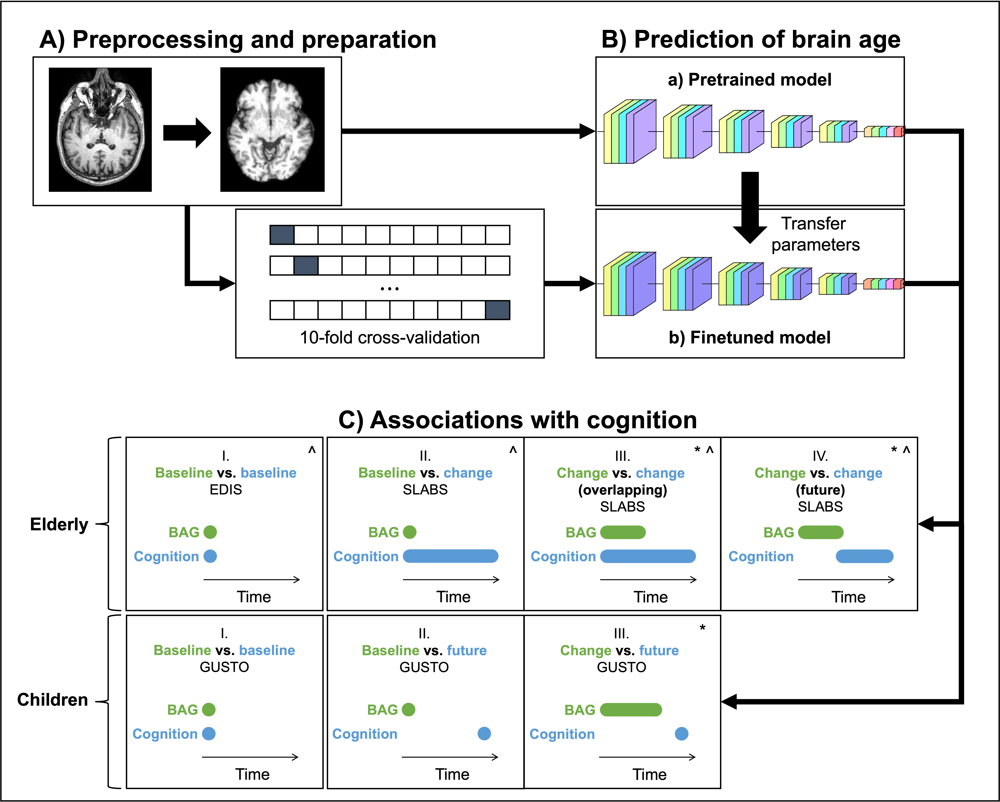
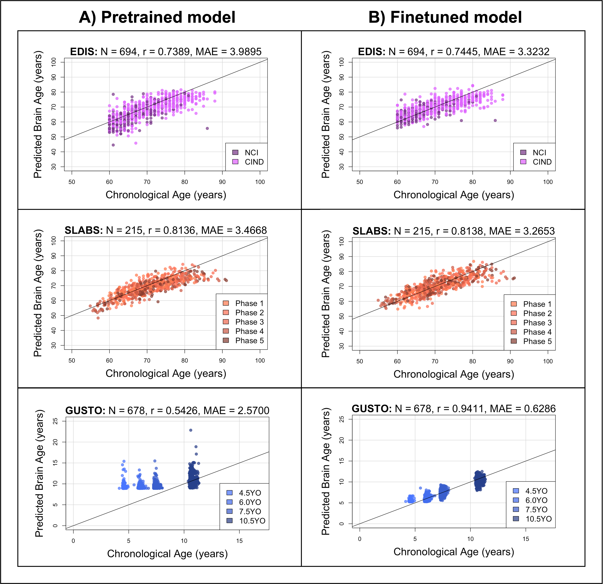
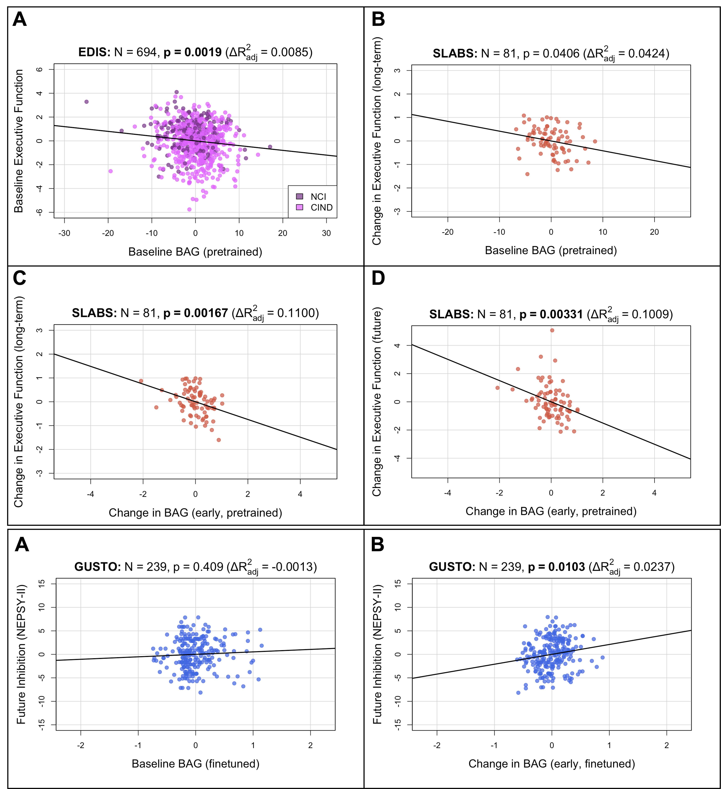

# Rate of brain aging associates with future executive function in Asian children and older adults

## Abstract
Brain age, which uses machine learning to estimate age based on brain features, has emerged as a powerful tool to understand neuroanatomical aging and its link to health outcomes like cognition. However, there remains a lack of studies investigating the rate of brain aging and its relationship to cognition. Furthermore, most brain age models are trained and tested on cross-sectional data from primarily Caucasian, adult participants. It is thus unclear how well these models generalize to non-Caucasian participants, especially children. Here, we tested a previously published deep learning model on Singaporean elderly participants (55 - 88 years old) and children (4 - 11 years old). We found that the model directly generalized to the elderly participants, but model finetuning was necessary for children. After finetuning, we found that the rate of change in brain age gap was associated with future executive function performance in both elderly participants and children. We further found that lateral ventricles and frontal areas contributed to brain age prediction in elderly participants, while white matter and posterior brain regions were more important in predicting brain age of children. Taken together, our results suggest that there is potential for generalizing brain age models to diverse populations. Moreover, the longitudinal change in brain age gap reflects developing and aging processes in the brain, relating to future cognitive function.

## Overview


Our work builds on the preprocessing pipeline and pretrained model from [pyment-public](https://github.com/estenhl/pyment-public) v1.0.0. 

Our scripts contain three sections: 
* Brain age [prediction](#prediction)
* Model [interpretability](#interpretability) using guided backpropagation
* Statistical [analysis](#analysis) of associations with cognition

**Due to data sharing agreements, the "data" folder only contains dummy data with the same structure as the original data.** Interpretability maps can be downloaded from [FigShare](https://figshare.com/articles/preprint/Brain_age_saliency_maps/24805545) and put under "output/interp" as shown below. Other output files are generated using the various scripts.

```
/data
┣ 📂 analysis
┃   ┗ 📜 EDIS.csv
┃   ┗ 📜 EDIS_exclude.csv
┃   ┗ ...

┣ 📂 prediction
┃   ┣ 📂 cropped
┃   ┃   ┣ 📂 images
┃   ┃   ┃   ┗ 📜 sub01.nii.gz
┃   ┃   ┃   ┗ ...
┃   ┃   ┣ 📂 labels
┃   ┃   ┃   ┣ 📂 10-fold
┃   ┃   ┃   ┃   ┗ 📜 0_test.csv
┃   ┃   ┃   ┃   ┗ 📜 0_train.csv
┃   ┃   ┃   ┃   ┗ 📜 0_val.csv
┃   ┃   ┃   ┃   ┗ ...
┃   ┃   ┗ 📜 labels.csv
┃   ┣ 📂 images
┃   ┃   ┗ 📜 sub01.nii.gz
┃   ┃   ┗ ...
┃   ┗ 📜 labels.csv

/output
┣ 📂 analysis
┃   ┣ 📂 brain_age_predictions
┃   ┣ 📂 cognitive_association_figures
┃   ┣ 📂 cognitive_association_tables
┃   ┃   ┣ 📂 csv
┃   ┃   ┣ 📂 html

┣ 📂 interp
┃   ┣ 📂 combined_maps
┃   ┃   ┣ 📂 finetuned
┃   ┃   ┣ 📂 pretrained
┃   ┣ 📂 feature_contributions
┃   ┃   ┣ 📂 finetuned
┃   ┃   ┣ 📂 pretrained
┃   ┣ 📂 cognitive_association_tables
┃   ┃   ┣ 📂 finetuned
┃   ┃   ┣ 📂 pretrained

┣ 📂 prediction
┃   ┣ 📂 finetuned
┃   ┣ 📂 pretrained

/parcellations
┗  📜 AAL3v1_1mm.nii
┗  📜 AAL3v1_1mm.nii.txt
┗ ...

/pyment-public
┣ 📂 pyment
┃   ┣ 📂 data
┃   ┃   ┣ 📂 datasets
┃   ┃   ┃   ┗ 📜 nifti_dataset.py
┃   ┣ 📂 models
┃   ┃   ┗ 📜 regression_sfcn.py
┣ 📂 scripts
┃   ┗ 📜 predict_brain_age.py
┃   ┗ 📜 preprocess_and_predict_brain_age.py
┗ (adapted from https://github.com/estenhl/pyment-public/releases/tag/v1.0.0)

/scripts
┣ 📂 analysis
┃   ┗ 📜 main.R
┃   ┗ 📜 plot_brain_age_predictions.Rmd
┃   ┗ 📜 run_all_cognitive_associations.R
┃   ┗ 📜 plot_all_cognitive_results.R
┃   ┗ ...

┣ 📂 interp
┗  📜 generate_maps_by_image.py
┗  📜 generate_maps.py
┗  📜 reg_maps_to_template.sh
┗  📜 average_maps.sh
┗  📜 display_map_slices.py
┗  📜 calculate_feature_contributions.py

┣ 📂 prediction
┗  📜 finetune_and_predict_brain_age.py
┗  📜 search_hyperparameters.py
```

## Environment setup

### Python (prediction & interp)
Install conda-build, if necessary
```sh
conda activate base
conda install conda-build
```
Create a conda environment named ```brain-age``` from ```requirements.txt```
```sh
conda create --name brain-age python=3.9
conda activate brain-age
pip install -r requirements.txt
```
Source ```pyment-public```
```sh
conda develop pyment-public
```

### R (analysis)
The necessary packages and installation script can be found at ```scripts/analysis/install.R```

## Prediction


### Preparing data
Our prediction scripts build on the scripts from [pyment-public](https://github.com/estenhl/pyment-public) v1.0.0. Thus, for off-the-shelf usage, the data should be organized as described [here](https://github.com/estenhl/pyment-public?tab=readme-ov-file#preparing-data). For finetuning, the ```labels.csv``` should be broken up into train, validation, and test sets and put under a ```labels``` folder and a folder describing the split, e.g. ```10-fold```. Multiple folds are supported by indexing by fold, e.g. ```0_test.csv``` contains the test set for fold 0.

An example data organization is given under ```data/prediction/```.

### Pretrained predictions
Preprocessing and predicting directly from the pretrained model can be run using ```preprocess_and_predict_brain_age.py```, e.g.
```sh
python pyment-public/scripts/preprocess_and_predict_brain_age.py \
        --folder data/prediction --model_name sfcn-reg --weights brain-age \
        --batch_size 2 --threads 4 --normalize \
        --destination output/prediction/pretrained/predictions.csv \
        --temp_folder data/prediction --verbose \
        --mni152_template /apps/fsl/5.0.2.2/data/standard/MNI152_T1_1mm_brain.nii.gz
```
This will generate the pretrained predictions at ```output/prediction/pretrained/predictions.csv```.

### Finetuned predictions
Finetuning can be run using ```finetune_and_predict_brain_age.py```. For example, to perform 10-fold cross-validation using 3 initial learning rates (as done in the paper), you could run
```sh
LRS=(1e-3 1e-4 1e-5)
for CONFIG in {0..2}
do
    LR=${LRS[$CONFIG]}
    for FOLD in {0..9}
    do
        python scripts/prediction/finetune_and_predict_brain_age.py \
        --folder data/prediction/cropped --model_name sfcn-reg \
        --weights brain-age --batch_size 4 --threads 4 --normalize \
        --destination output/prediction/finetuned/config_${CONFIG}/fold_${FOLD}/test_pred.csv \
        --split "10_fold" --fold ${FOLD} --max_epochs 35 --dropout_rate 0.3 \
        --weight_decay 1e-3 --initial_learning_rate ${LR} --lr_decay_epochs 25 \
        --log_path output/prediction/finetuned/config_${CONFIG}/fold_${FOLD}
    done
done
```
Then, predictions from the best hyperparameters can be extracted using ```search_hyperparameters.py```, e.g.
```sh
python scripts/prediction/search_hyperparameters.py \
        -p "output/prediction/finetuned/config_0" \
           "output/prediction/finetuned/config_1" \
           "output/prediction/finetuned/config_2"\
        -i "fold_0" "fold_1" "fold_2" "fold_3" "fold_4" \
           "fold_5" "fold_6" "fold_7" "fold_8" "fold_9" \
        -d output/prediction/finetuned/predictions.csv
```
This will generate the finetuned predictions at ```output/prediction/finetuned/predictions.csv```.

Plots were generated using ```scripts/analysis/plot_brain_age_predictions.Rmd```.

## Interpretability


Assuming data and predictions are structured as in the previous section, guided backpropagation maps can be generated using
```sh
python scripts/interp/generate_maps.py
```
which calls ```generate_maps_by_image.py``` to produce maps for each image, for both pretrained and finetuned models. 

Individual maps are stored at ```output/interp/guided_backprop_maps/```. These can then be registered to a common template using ```reg_maps_to_template.sh```, e.g.
```sh
sh scripts/interp/reg_maps_to_template.sh \
    -a /apps/ants/ants_v2.2.0/Scripts \
    -t /apps/fsl/5.0.2.2/data/standard/MNI152_T1_1mm_brain.nii.gz \
    -i data/prediction/cropped/images/sub01.nii.gz \
    -o output/interp/registered_maps \
    -p output/interp/guided_backprop_maps/pretrained/sub01.nii \
    -f output/interp/guided_backprop_maps/finetuned/sub01.nii
```
where registered maps are stored at ```output/interp/registered_maps/```.

Maps can then be averaged across subjects using FSL, e.g.
```sh
for MODEL_TYPE in "pretrained" "finetuned"
do
    file_paths=()
    for ID in "sub01" "sub02" "sub03" "sub04" "sub05" "sub06" "sub07" "sub08" "sub09" "sub10"
    do
        file_paths+=("output/interp/registered_maps/${MODEL_TYPE}/${ID}.nii.gz")
    done
    OUT_PATH="output/interp/combined_maps/${MODEL_TYPE}"
    
    mkdir -p ${OUT_PATH}
    fslmerge -a ${OUT_PATH}/combined.nii.gz ${file_paths[@]}
    fslmaths ${OUT_PATH}/combined.nii.gz -Tmean ${OUT_PATH}/averaged.nii.gz
done
```
which stores the averaged maps at ```output/interp/combined_maps/```.

The top 10\% of features can be visualized overlaid on brain slices using ```display_map_slices.py```, e.g.
```sh
for MODEL_TYPE in "pretrained" "finetuned"
do
    python scripts/interp/display_map_slices.py \
    -m output/interp/combined_maps/${MODEL_TYPE}/averaged.nii.gz \
    -t /apps/fsl/5.0.2.2/data/standard/MNI152_T1_1mm_brain.nii.gz \
    -o output/interp/map_slices/${MODEL_TYPE} \
    -c -p -b /apps/fsl/5.0.2.2/data/standard/MNI152_T1_1mm_brain_mask.nii.gz
done
```
which saves the 2D images at ```output/interp/map_slices/```.

Finally, relative feature contributions can be calculated and displayed as a bar chart using ```calculate_feature_contributions.py```, e.g.
```sh
for MODEL_TYPE in "pretrained" "finetuned"
do
    python scripts/interp/calculate_feature_contributions.py \
    -m output/interp/combined_maps/${MODEL_TYPE}/averaged.nii.gz \
    -o output/interp/feature_contributions/${MODEL_TYPE} \
    -b /apps/fsl/5.0.2.2/data/standard/MNI152_T1_1mm_brain_mask.nii.gz \
    -a parcellations
done
```
which saves the bar charts at ```output/interp/feature_contributions/```. Features are defined using the [Schaefer](https://github.com/ThomasYeoLab/CBIG/tree/master/stable_projects/brain_parcellation/Schaefer2018_LocalGlobal/Parcellations/MNI), [AAL](https://www.gin.cnrs.fr/en/tools/aal/), and [ICBM-DTI-81](http://www.bmap.ucla.edu/portfolio/atlases/ICBM_DTI-81_Atlas/) parcellations for corticial gray matter, subcortical gray matter, and white matter, respectively.

## Analysis


All analysis scripts can be run using ```scripts/analysis/main.R```. Example (fake) data is provided at ```data/analysis/```. R Markdown files generally produce individual figures (or tables) which are saved in html (csv). R scripts contain helper functions or serve as wrappers, e.g. ```run_all_cognitive_associations.R``` calls ```run_cognitive_associations.Rmd``` to produce the cognitive association tables, and ```plot_all_cognitive_results.R``` calls ```plot_cognitive_results.Rmd``` to produce the cognitive association figures (above). All results are stored under ```output/analysis/```.

## Acknowledgements
We would like to thank all participants and the research teams of GUSTO, EDIS, and SLABS for their contributions. We would also like to thank Esten Leonardsen and team for making the [SFCN pretrained model and code](https://github.com/estenhl/pyment-public) available and for providing suggestions on hyperparameters. Finally, we would like to thank all HZLab members for helpful discussions!

## Citation
```
@misc{cheng_rate_2024,
        title = {Rate of brain aging associates with future executive function in Asian children and older adults},
	doi = {10.1101/2023.11.27.568184},
	publisher = {bioRxiv},
	author = {Cheng, Susan F. and Yue, Wan Lin and Ng, Kwun Kei and Qian, Xing and Liu, Siwei and Tan, Trevor W. K. and Nguyen, Kim-Ngan and Leong, Ruth L. F. and Hilal, Saima and Cheng, Ching-Yu and Tan, Ai Peng and Law, Evelyn C. and Gluckman, Peter D. and Chen, Christopher Li-Hsian and Chong, Yap Seng and Meaney, Michael J. and Chee, Michael W. L. and Yeo, B. T. Thomas and Zhou, Juan Helen},
	year = {2024}
}
```

## Bugs and Questions
Please contact Susan Cheng at sfcheng17@gmail.com and Helen Zhou at helen.zhou@nus.edu.sg.
